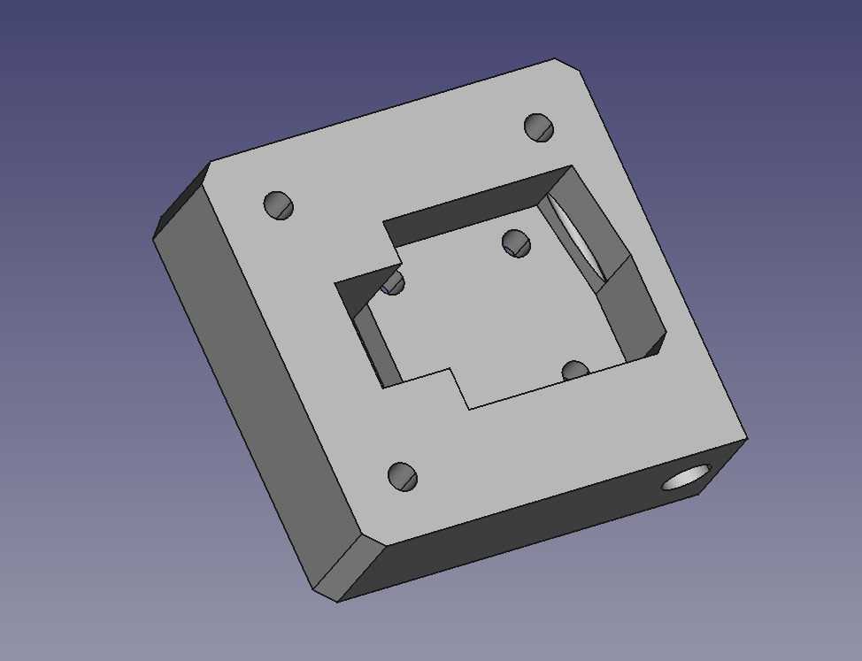

# Nema17-Filament-Runout-Sensor

Fully parametric filament runout sensor with integrated bowden coupler for 3D printers,.
designed to fit on a Nema17 mount.

Why would you do this? Well after upgrading my Q5 delta's to use Sailfin extruders,
I had a big hole on the side of the printer where the extruder motor was mounted.

This mount point was also inline with the filament path, so it seemed like a good
placement for a runout sensor with an integrated bowden coupler (for a reverse
bowden setup).

# Print Settings

I printed this in ABS with 1.5mm walls and 15% infill using ABS (PETG or PLA should be fine).

These items can be printed support free.

# Bill of Materials

This sensor mount is pretty simple, you will need:

* 1x 20mm x 20mm limit switch (such as: https://www.amazon.co.uk/Printer-Endstop-Mechanical-Switch-Compatible/dp/B091PHDN5L/)
* 8-10 M3 x 5mm bolts
* 1x M6 pnumatic coupler (such as: https://www.amazon.co.uk/dp/B09WN2N6ZB/)

# Modifications

This item is built using Freecad (source files provided). It has been built parametrically
and all measurements are located in the spreadsheet called `data`. 

# Gallery

